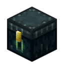

# Expanded Enderchest (for Fabric)

Expanded Enderchest is a free and open-source mod for Minecraft which doubles the size of your enderchest.

	

---

## Features
This mod does one thing, it doubles the size of your enderchest.

---

## Installation

### Manual installation

You will need Fabric Loader 0.10.x or newer installed in your game in order to load Expanded Enderchest.
If you haven't installed Fabric mods before, you can find a variety of community 
guides for doing so [here](https://fabricmc.net/wiki/install).

#### Stable releases

The latest releases of Expanded Enderchest are published to our [Modrinth](https://modrinth.com/mod/expanded-enderchest),
[CurseForge](https://www.curseforge.com/minecraft/mc-mods/expanded-enderchest),
and [GitHub release](https://github.com/ChristopherHaws/mc-expanded-enderchest/releases) pages. Releases
are considered to be **suitable for general use**, but they are not guaranteed to be free of bugs 
and other issues.

Usually, releases will be made available on GitHub slightly sooner than other locations.

#### Bleeding-edge builds (unstable)

If you are a player who is looking to get your hands on the latest **bleeding-edge changes for 
testing**, consider taking a look at the automated builds produced through our
[GitHub Actions workflow](https://github.com/ChristopherHaws/mc-expanded-enderchest/actions/workflows/build.yml?query=event%3Apush).
This workflow automatically runs every time a change is pushed to the repository, and as such, 
the builds it produces will generally reflect the latest snapshot of development.

Bleeding edge builds will often include unfinished code that hasn't been extensively tested. 
That code may introduce incomplete features, bugs, crashes, and all other kinds of weird issues. 
You **should not use these bleeding edge builds** unless you know what you are doing and are 
comfortable with software debugging.

### Reporting Issues
You can report bugs and crashes by opening an issue on our [issue tracker](https://github.com/ChristopherHaws/mc-expanded-enderchest/issues).
Before opening a new issue, use the search tool to make sure that your issue has not already 
been reported and ensure that you have completely filled out the issue template. Issues that are 
duplicates or do not contain the necessary information to triage and debug may be closed.

Please note that while the issue tracker is open to feature requests, development is primarily 
focused on improving hardware compatibility, performance, and finishing any unimplemented 
features necessary for parity with the vanilla renderer.

---
### License
Expanded Enderchest is licensed under GNU LGPLv3, a free and open-source license. For more information, 
please see the [license file](https://github.com/ChristopherHaws/mc-expanded-enderchest/blob/main/LICENSE).
